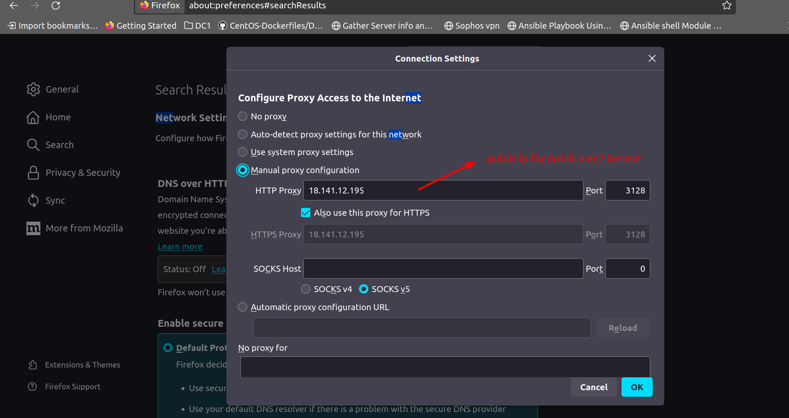
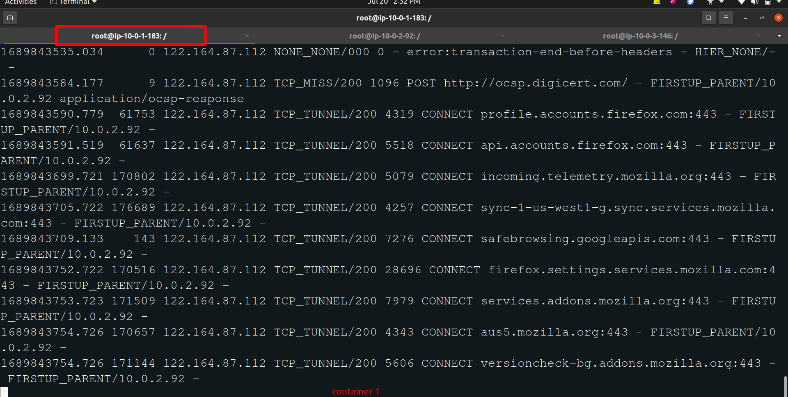
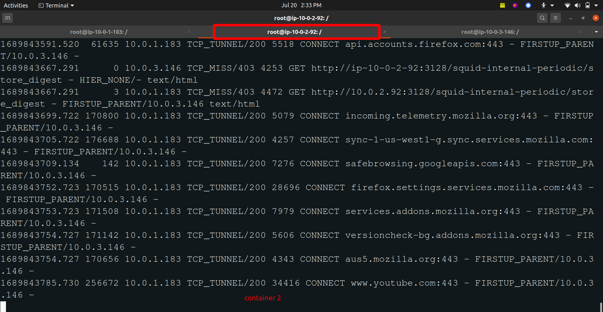
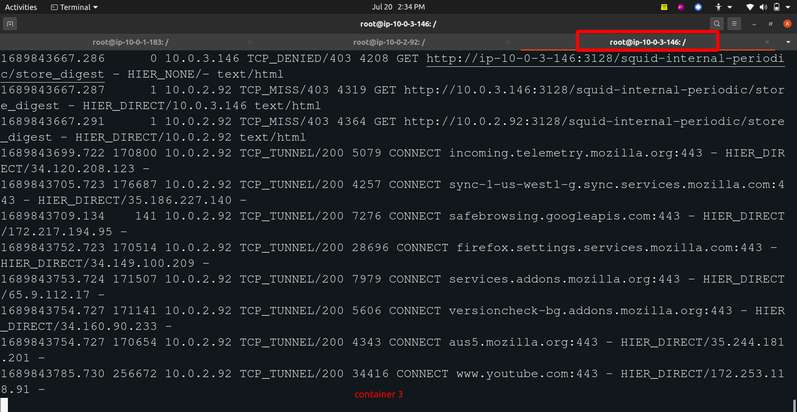

This is 3 EC2 instance configuration
----------------------------------
_vpc configuraiton_

| Resource | CIDR Range  |instance type|
|----------|-------------|-------------|
| VPC      | 10.0.0.0/16 |             |
| subnet 1 | 10.0.1.0/24 |  public     |
| subnet 2 | 10.0.2.0/24 |  private    |
| subnet 3 | 10.0.3.0/24 |  public     |

_squid configuration_

| squid name   | subnet range | EC2 Ins type   |
| ------------ | ------------ | --------- |
| iz-it-squid  | 10.0.1.183   | public a  |
| ez-it-squid  | 10.0.2.92    | private b |
| ez-gut-squid | 10.0.3.146   | public c  |

_traffic flow_

     [Client]
        |
        | iz-it-squid   (10.0.1.183)  => public a ec2 instance
        |
        | ez-it-squid   (10.0.2.92)   => private b ec2 instance
        |
        | ez-gut-squid  (10.0.2.92)   => public c ec2 instance
        |
    [Internet]

_works_

```bash
# create a image with container
docker run -d --name container1 --network=host joeashli/iz-it-squid
docker run -d --name container2 --network=host joeashli/ez-it-squid
docker run -d --name container3 --network=host joeashli/ez-gut-squid

# inspect the container details
docker inspect container1

# login ot the container 
docker exec -it containerName bash

```

OUTPUT
--------

1. Go to the browser and past the public a ec2 instance `public ip address` 

`Firefox => network settings => manual proxy configuration`



2. open a new tab and check the network using the `any url` like...(youbtube.com)

3. Login to the 3 containers and execute the below command for debug:

```bash
tail -f /var/log/squid/access.log
```







**_Enable system level proxy configuration_**

```sh
# sudo vim /etc/environment
export http_proxy="http://18.141.12.195:3128/"
export https_proxy="http://18.141.12.195:3128/" 
```

**_Enable docker proxy configuration_** 
```sh
# sudo mkdir -p /etc/systemd/system/docker.service.d
# sudo vi /etc/systemd/system/docker.service.d/proxy.conf

[Service]
Environment="HTTP_PROXY=http://18.141.12.195:3128/"
Environment="HTTPS_PROXY=http://18.141.12.195:3128/"
Environment="NO_PROXY="localhost,127.0.0.1,::1"
```
verify the docker proxy configuration
```sh
sudo systemctl show docker --property Environment
sudo docker info
```
After adding the above content, we have to run the below command
```sh
sudo systemctl daemon-reload
sudo systemctl restart docker.service
```
_docker debug_
```sh
docker pull mysql
docker pull httpd
docker login
```
---
**Note:-**
```sh
# build a docker image in my local and push a docker image to docker hub
docker build -t joeashli/iz-it-squid .
docker push joeashli/iz-it-squid

docker build -t joeashli/ez-it-squid .
docker push joeashli/ez-it-squid

docker build -t joeashli/ez-gut-squid .
docker push joeashli/ez-gut-squid
```

