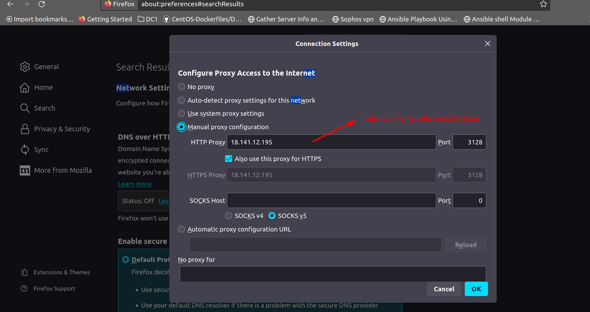
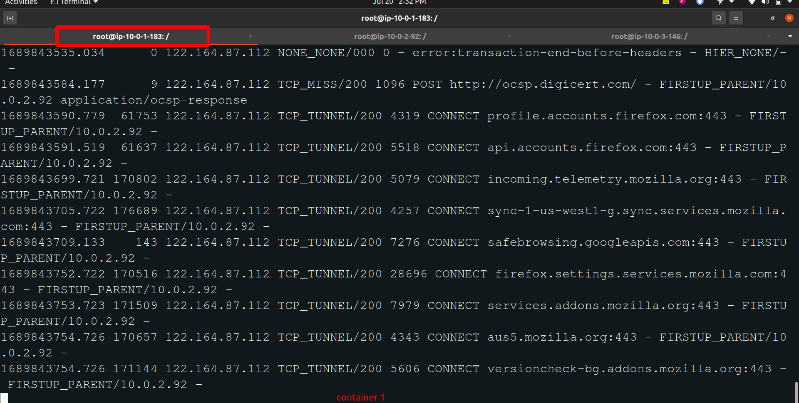
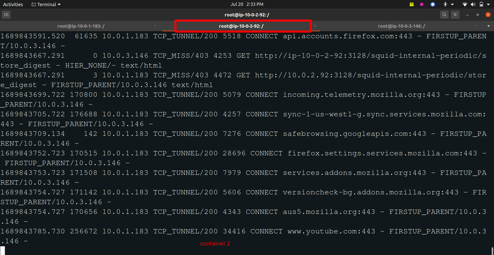
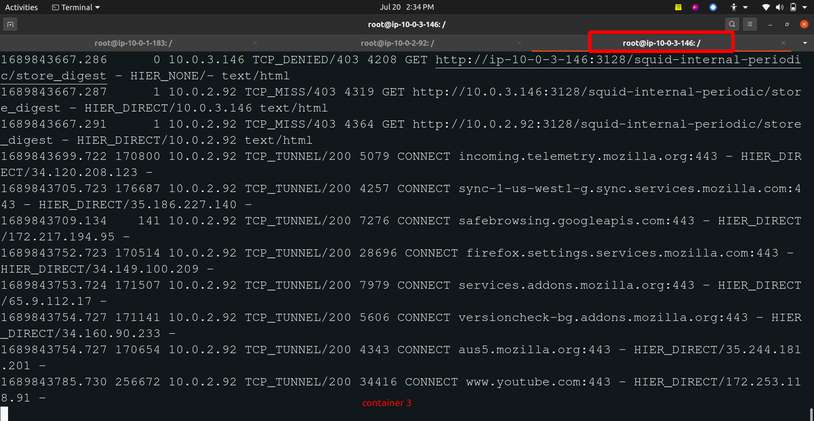

_squid configuration_

| squid name   | subnet range | EC2 Ins type   |
| ------------ | ------------ | --------- |
| iz-it-squid  | 10.0.1.183   | public a  |
| ez-it-squid  | 10.0.2.92    | private b |
| ez-gut-squid | 10.0.3.146   | public c  |

_traffic flow_

     [Client]
        |
        | iz-it-squid   (10.0.1.183)  => public a ec2 instance
        |
        | ez-it-squid   (10.0.2.92)   => private b ec2 instance
        |
        | ez-gut-squid  (10.0.2.92)   => public c ec2 instance
        |
    [Internet]

_works_

```bash
# create a image with container
docker run -d --name container1 --network=host joeashli/iz-it-squid
docker run -d --name container2 --network=host joeashli/ez-it-squid
docker run -d --name container3 --network=host joeashli/ez-gut-squid

# inspect the container details
docker inspect container1

# login ot the container 
docker exec -it containerName bash

```

OUTPUT
--------

1. Go to the browser and past the public a ec2 instance `public ip address` 

Firefox => network settings => manual proxy configuration


2. open a new tab and check the network using the `any url` like...(youbtube.com)

3. Login to the 3 containers and execute the below command for _debug_ the follow:

```bash
tail -f /var/log/squid/access.log
```





```sh
# build a docker image in my local and push a docker image to docker hub
docker build -t joeashli/iz-it-squid .
docker push joeashli/iz-it-squid

docker build -t joeashli/ez-it-squid .
docker push joeashli/ez-it-squid

docker build -t joeashli/ez-gut-squid .
docker push joeashli/ez-gut-squid
```
